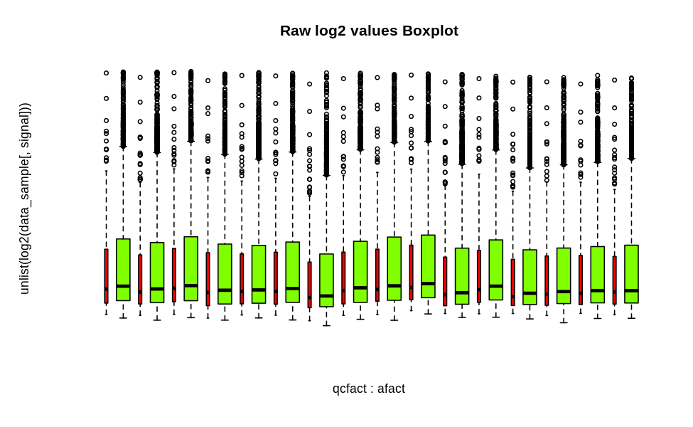
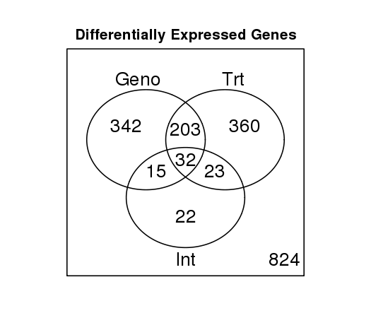
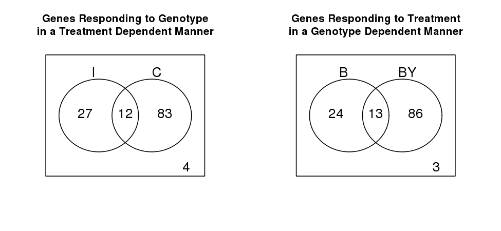

## Tarea 7.1: Análisis de expresión diferencial usando microarreglos.
#### José Miguel Amaro Estrada

### Preliminares

Se realizó un muestreo aleatorio de 5000 filas del archivo de datos original. Para esto se utilizó la libreria dplyr.

```
library(dplyr)
#### Load original data matrix
data <- read.delim("data_raw.txt", header=T)

#### Sample 500 random rows
data_sample <- sample_n(data, 5000, replace=FALSE)
#### Add column names to the subset
colnames(data_sample) <- c("ID_REF","CDR017","Detection Pval","BEAD_STDERR","Avg_NBEADS","CDR025","Detection Pval","BEAD_STDERR","Avg_NBEADS","CDR021","Detection Pval","BEAD_STDERR","Avg_NBEADS","CDR029","Detection Pval","BEAD_STDERR","Avg_NBEADS","CDR022","Detection Pval","BEAD_STDERR","Avg_NBEADS","CDR018","Detection Pval","BEAD_STDERR","Avg_NBEADS","CDR026","Detection Pval","BEAD_STDERR","Avg_NBEADS","CDR030","Detection Pval","BEAD_STDERR","Avg_NBEADS","CDR031","Detection Pval","BEAD_STDERR","Avg_NBEADS","CDR023","Detection Pval","BEAD_STDERR","Avg_NBEADS","CDR027","Detection Pval","BEAD_STDERR","Avg_NBEADS","CDR019","Detection Pval","BEAD_STDERR","Avg_NBEADS","CDR020","Detection Pval","BEAD_STDERR","Avg_NBEADS","CDR028","Detection Pval","BEAD_STDERR","Avg_NBEADS","CDR032","Detection Pval","BEAD_STDERR","Avg_NBEADS","CDR024","Detection Pval","BEAD_STDERR","Avg_NBEADS")


#### Export sample data table
write.table(data_sample, "data_sample.txt")
```
Se creo el directorio "output" y se definieron las constantes y funciones necesarias para los análisis posteriores. Concretamente, el directorio de salida y la tasa de error aceptable

```
outdir <- "output"
fdr_th <- 0.19
source("Rfxs.R")
```
Se seleccionaron los datos de intensidad y de los valores de p de la detección a partir del subset de datos seleccionados. Además, se leyó el archivo con las anotaciones completas.

```
signal <- grep("CDR", colnames(data_sample))
detection <- grep("Detection.Pval", colnames(data_sample))
annot <- read.delim("MouseRef-8_annot_full.txt")
data_names <- rownames(my_data)
annot = annot[row.names(annot)%in%data_names,]
```
Se agrupó a las sondas como buenas o malas, dependiendo de su calidad al alinearse contra el genoma de referencia.

```
probe_qc <- ifelse(annot$ProbeQuality %in% c("Bad", "No match"), "Bad probes",
  "Good probes")
```
Se leyó la tabla con el diseño de las hibridaciones.

```
design <- read.csv("YChrom_design.csv")
 print(design)
```

Se generaron los gráficos de control de calidad de las sondas

```
palette(rainbow(4))
alabel <- sprintf("Array%02i", 1:length(signal))
afact  <- factor(rep(alabel, each=nrow(data_sample)))
qcfact <- factor(rep(probe_qc, length(signal)))
 png(file.path(outdir,"boxplot_raw_probe_qc.png"), width=6.5, height=4, unit="in", res=150)

 par(xpd=NA, mar= c(6.1, 5.1, 4.1, 2.1), cex=.7, las=3)
   boxplot(unlist(log2(data_sample[,signal]))~qcfact+afact, horiz=T, main="Raw log2 values Boxplot",
           col=rep(1:2, length(signal)), axes=F, varwidth=TRUE)
   axis(1, at=seq(1, length(signal)*2, by=2)+.5, labels=alabel)
   axis(2)
   legend("top", legend=levels(qcfact), fill=1:2, ncol=2, xjust=.5, bty="n", inset=-.1)

 dev.off()
```



Posteriormente se generaron los gráficos de calidad por por tratamientos

```
png(file.path(outdir,"boxplot_raw_treatment.png"), width=4, height=4, unit="in", res=150)

 par(xpd=NA, mar= c(6.1, 4.1, 4.1, 2.1), cex=.7)
 boxplot(as.data.frame(log2(data[,signal])), horiz=T, main="Raw log2 values Boxplot", las=1, col=design$Treatment, names=design$Sentrix_Position, cex.axis=.9)
 legend(8, 2.5, legend=levels(design$Treatment), fill=1:2, ncol=2, xjust=.5)

 dev.off()
```


Finalmente, se generaron los diagramas de dispersión de los datos sin procesar.

```
png(file.path(outdir,"Pairs_scatter_log2.png"), width=8, height=8, unit="in", res=150)
 par(cex=.2, mar=c(2.1,2.1,2.1,1.1))
 pairs(log2(data[,signal]), main="Log2 Raw Intensity Values", pch=".",  gap=.5, cex.labels=.5)
 dev.off()
```

### Filtrado de las sondas de acuerdo a su QC

```
Data.Raw <- data[probe_qc %in% "Good probes",]
annot    <- annot[probe_qc %in% "Good probes",]
```
Se creo un microarreglo con los datos brutos.

```
rawdata           <- as.matrix(Data.Raw[,signal])
rownames(rawdata) <- Data.Raw$PROBE_ID
colnames(rawdata) <- design$Sample_Name
```
### Normalización de losa datos

Se realizó una normalización de los datos usando el método por cuantiles, para lo cual se utilizó el paquente `preprocessCore`.

```
library(preprocessCore)
normdata           <- normalize.quantiles(rawdata)
colnames(normdata) <- colnames(rawdata)
rownames(normdata) <- rownames(rawdata)
```
### Filtrado de sondas

En este paso, se filtraron las sondas que no detectaron transcritos en ninguno de los tratamientos. Las sondas se seleccionaron cuando su recuento fuera de al menos 25% en todos los grupos experimentales.

```
probe_present <- Data.Raw[,detection] < 0.04
 detected_per_group <- t(apply(probe_present, 1, tapply, design$Group, sum))
 present  <- apply(detected_per_group >= 1, 1, all)
 normdata <- normdata[present,]
 annot    <- annot[present, ]
 ```

 ### Prueba de expresión diferencial.

 ```
 library(maanova)
madata <- read.madata(normdata, design, log.trans=T)
fit.fix <- fitmaanova(madata, formula=~Group)
```
Se estimaron estadísticos generales para cada grupo experimentales

```
Means           <- t(apply(madata$data, 1, tapply, design$Group, mean))
 colnames(Means) <- paste("Mean", colnames(Means), sep=":")
 SEs             <- t(apply(madata$data, 1, tapply, design$Group, function(x) sqrt(var(x)/length(x))))
 colnames(SEs)   <- paste("SE", colnames(SEs), sep=":")
 ```

 ### Construcción de matriz de contrastes

 Este tipo de matrices se utilizaron para contrastar los grupos experimentales y determinar la porción de la varianza en los datos de expresión que son explicados por estas comparaciones. Con los contrastes contenidos en la matriz, se pueden calcuar los *foldchange* que pueden ser de interés. Se calculó la matriz de diferencia entre grupos y se transformó de escala logarítmica a la escafa *foldchange*.

 ```
####### Construir la matriz de contrastes
cmat <- rbind(Geno     =  c( 1,   1,  -1,  -1 )*.5,
              Trt      =  c( 1,  -1,   1,  -1 )*.5,
              Int      =  c( 1,  -1,  -1,   1 ),
              Geno_I   =  c( 0,   1,   0,  -1 ),
              Geno_C   =  c( 1,   0,  -1,   0 ),
              Trt_B    =  c( 1,  -1,   0,   0 ),
              Trt_BY   =  c( 0,   0,   1,  -1 ),
              B.C_BY.I =  c( 1,   0,   0,  -1 ),
              B.I_BY.C =  c( 0,   1,  -1,   0 ))

 logDiffs  <- Means %*% t(cmat)
 FC <- apply(logDiffs, 2, logdiff2FC) ### Función definida en Rfxs.R

 ```

 Se probó cada contraste utilizando 500 permutaciones de las muestras.

 ```
 test.cmat <- matest(madata, fit.fix, term="Group", Contrast=cmat, n.perm=500,
                    test.type = "ttest", shuffle.method="sample", verbose=TRUE)
#### Copiar los nombres de los contrastes del microarreglo
colnames(test.cmat$Fs$Pvalperm) <- colnames(test.cmat$Fs$Ptab)

#### Control de comparaciones múltipes usando transformación FDR
test.cmat <- adjPval(test.cmat, method="adaptive")
```
Se graficaron los valores de P comparando distintas formas de calcularlos

```
png(file.path(outdir,"P-values Hist.png"), width=6, height=6, unit="in", res=150)
par(mfrow=c(2,2), oma=c(2,0,2,0), cex=.8, xpd=NA)
palette(rainbow(3))
plot(density(test.cmat$F1$Ptab[,1]), col=1, main="F1:Ptab", lwd=2)
lines(density(test.cmat$F1$Ptab[,2]), col=2, lwd=2)
lines(density(test.cmat$F1$Ptab[,3]), col=3, lwd=2)

plot(density(test.cmat$F1$Pvalperm[,1]), col=1, main="F1:Pvalperm", lwd=2)
lines(density(test.cmat$F1$Pvalperm[,2]), col=2, lwd=2)
lines(density(test.cmat$F1$Pvalperm[,3]), col=3, lwd=2)

plot(density(test.cmat$Fs$Ptab[,1]), col=1, main="Fs:Ptab", lwd=2)
lines(density(test.cmat$Fs$Ptab[,2]), col=2, lwd=2)
lines(density(test.cmat$Fs$Ptab[,3]), col=3, lwd=2)

plot(density(test.cmat$Fs$Pvalperm[,1]), col=1, main="Fs:Pvalperm", lwd=2)
lines(density(test.cmat$Fs$Pvalperm[,2]), col=2, lwd=2)
lines(density(test.cmat$Fs$Pvalperm[,3]), col=3, lwd=2)

legend(-.5, -1.6, legend=c("Geno", "Trt", "Int"), col=1:3,lwd=2,xjust=.5,ncol=3,xpd=NA)
dev.off()
```
Se resumieron los resultados de todos los transcritos presentes en una tabla de las pruebas Fs y valores Pvalperm de permutaciones.

```
results <- data.frame(annot, Means, SEs, F_val=test.cmat$Fs$Fobs,
                       P_val=test.cmat$Fs$Pvalperm, FDR=test.cmat$Fs$adjPvalperm, FC=FC)

write.table(results, file=file.path(outdir,"DE_results.csv"), sep=",", row.names=F)
```

### Conteo de genes expresados diferencialmente

El objetivo que se tuvo en este trabajo, fue determinar los niveles de expresión génica en dos genotipos al ser sometidos a un tratamiento experimental. En particular, se buscó determinar si existe una interacción entre el genotipo y el tratamiento a la hora de determinar la expresión génica y determinar la naturaleza de la interacción.

Para esto se elaboraron diagramas de Venn con el objetivo de contar el número de genes que se seleccionaron en cada genotipo, pero con un efecto significativo de interacción. Es decir, se utilizaron los contrastes que prueban las diferencias de genotipo dentro de cada nivel de tratamiento, y viceversa.

```
#### Crear un identificador del gen basado en EntrezGene y utilizar el ID de la sonda cuando no esté asociada a un gen
results$GeneID <- results$EntrezID
 results$GeneID[is.na(results$GeneID)] <- results$ProbeID[is.na(results$GeneID)]
 ```
 Se contaron las sondas seleccionadas por expresión diferencial por genotipo, tratamiento y/o interacción.

 ```
 Probes.DE <- results[, c("FDR.Geno", "FDR.Trt", "FDR.Int")]  <= fdr_th
 Genes.DE  <- apply(Probes.DE, 2, tapply, results$GeneID, all)
 ```


Usando solo las sondas seleccionadas por efectos de interacción, se contaron las sondas significativas para el efecto de genotipo en ratones intactos (I) y/o castrados (C) .

```
Probes.Int_Geno <- results[results$FDR.Int <= fdr_th,
                            c("FDR.Geno_I", "FDR.Geno_C")] <= fdr_th
 Genes.Int_Geno  <- apply(Probes.Int_Geno, 2, tapply,
                          results$GeneID[results$FDR.Int <= fdr_th], all)
```
Usando solamente sondas seleccionadas por efectos de interacción, se contaron las sondas significativas para el efecto de tratamiento en ratones del genotipo B y/o del genotipo BY.

```
Probes.Int_Trt  <- results[results$FDR.Int <= fdr_th,
                            c("FDR.Trt_B", "FDR.Trt_BY")]  <= fdr_th
 Genes.Int_Trt   <- apply(Probes.Int_Trt, 2, tapply,
                          results$GeneID[results$FDR.Int <= fdr_th], all)

```

Se generaron diagramas de Venn para contar genes para cada combinación de efectos marginales y de interacción así como para contar los genes DE entre niveles de un factor condicional en el otro factor.

```
library(limma)

Counts.DE <- vennCounts(Genes.DE)
print(Counts.DE)
attr(,"class")

Counts.Int_Geno <- vennCounts(Genes.Int_Geno)
print(Counts.Int_Geno)
attr(,"class")

Counts.Int_Trt  <- vennCounts(Genes.Int_Trt)
print(Counts.Int_Trt)
attr(,"class")
```

Se graficaron los genes por sus efectos marginales o de interacción.

```
png(file.path(outdir, "vennDiagram_DiffExprs.png"), width=3.5, height=3, unit="in", res=150)
 par(cex=.7)
 vennDiagram(Counts.DE, names=c("Geno", "Trt", "Int"),
             main="\n\n\nDifferentially Expressed Genes")
 dev.off()
```

Finalmente, se graficaron los genes DE que responden al genotipo dependiendo del tratamiento y viceversa.

```
png(file.path(outdir, "vennDiagram_Int.png"), width=6.5, height=3, unit="in", res=150)

 par(mfrow=c(1,2), cex=.7)
 vennDiagram(Counts.Int_Geno, names=c("I", "C"),
             main="\n\n\nGenes Responding to Genotype\nin a Treatment Dependent Manner")
 vennDiagram(Counts.Int_Trt, names=c("B", "BY"),
             main="\n\n\nGenes Responding to Treatment\nin a Genotype Dependent Manner")

 dev.off()
```

### Pruebas funcionales
Se investigó si alguna función biológica estaba enriquecida entre los genes expresado diferencialmente. Para esto se usó la librería `topGO`.

```
library("topGO")
probes.int <- results[, "FDR.Int"]  <= fdr_th ## Sondas seleccionadas por intereacción

genes.int <- tapply(probes.int, results$EntrezID, any) ## Resumir por gen.

genes.int <- ifelse(genes.int, 1, 0) ## Lógico a vector

genes.int <- as.factor(genes.int) ## Convertir a factor

## Generar objeto topGO
GOdata <- new("topGOdata", ontology="BP", allGenes=genes.int,
               description="Genes DE by Trt by GenoInteraction", nodeSize=5,
               annotationFun=annFUN.org, mapping="org.Mm.eg.db", ID="entrez")
```
Finalmente se realizaron las pruebas de enriquecimiento utilizando una prueba exacta de Fisher. Para esto, se utilizaron dos algoritmos: a prueba clásica de término por término y el algoritmo "elim" , que tiene en cuenta la jerarquía de los términos GO para evitar la redundancia.

```
resultFisher.classic <- runTest(GOdata, algorithm = "classic", statistic = "fisher")
 resultFisher.elim    <- runTest(GOdata, algorithm = "elim", statistic = "fisher")

 GO_BP_Table <- GenTable(GOdata,topNodes = 20, Fisher.classic=resultFisher.classic,
                         Fisher.elim=resultFisher.elim,
                         orderBy = "Fisher.elim", ranksOf = "Fisher.classic")

 print(GO_BP_Table)
 write.table(GO_BP_Table, file.path(outdir, "GO_BP_Table.csv"), sep=",",
  row.names=F)
 ```
### Conclusiones

De acuerdo con los resultados, se obtuvieron 824 genes expresados diferencialmente, de los cuales 383 tuvieron una respuesta por genotipo y 372 por tratamiento, mientras que 26 mostraron un efecto de interacción.



Por otro lado, puede observarse que el genotipo BY presentó un mayor número de genes expresados diferencialmente como respuesta al tratamiento, comparado con el genotipo B.



Finalmente, las pruebas de enriquecimiento revelaron que las funciones mayormente representadas entre los genes expresados diferencialmente corresponden a la regulación de la comunicación celular y a la regulación de la señalización.

| GO.ID      | Term                                        | Annotated | Significant | Expected | Rank in Fisher.classic | Fisher.classic | Fisher.elim |
|------------|---------------------------------------------|-----------|-------------|----------|------------------------|----------------|-------------|
| GO:0030968 | endoplasmic reticulum unfolded protein r... | 5         | 3           | 0.34     | 9                      | 0.0028         | 0.0028      |
| GO:0043502 | regulation of muscle adaptation             | 10        | 4           | 0.68     | 10                     | 0.0031         | 0.0031      |
| GO:0042325 | regulation of phosphorylation               | 98        | 14          | 6.67     | 21                     | 0.0051         | 0.0051      |
| GO:0043525 | positive regulation of neuron apoptotic ... | 6         | 3           | 0.41     | 22                     | 0.0053         | 0.0053      |
| GO:0070059 | intrinsic apoptotic signaling pathway in... | 6         | 3           | 0.41     | 23                     | 0.0053         | 0.0053      |
| GO:0070555 | response to interleukin-1                   | 6         | 3           | 0.41     | 24                     | 0.0053         | 0.0053      |
| GO:1901661 | quinone metabolic process                   | 6         | 3           | 0.41     | 25                     | 0.0053         | 0.0053      |
| GO:1903426 | regulation of reactive oxygen species bi... | 6         | 3           | 0.41     | 26                     | 0.0053         | 0.0053      |
| GO:0009605 | response to external stimulus               | 132       | 17          | 8.98     | 32                     | 0.0062         | 0.0062      |
| GO:0022008 | neurogenesis                                | 90        | 13          | 6.12     | 33                     | 0.0063         | 0.0063      |
| GO:0031401 | positive regulation of protein modificat... | 81        | 12          | 5.51     | 38                     | 0.0071         | 0.0071      |
| GO:0048585 | negative regulation of response to stimu... | 102       | 14          | 6.94     | 40                     | 0.0074         | 0.0074      |
| GO:0045892 | negative regulation of transcription, DN... | 62        | 10          | 4.22     | 41                     | 0.0076         | 0.0076      |
| GO:0016477 | cell migration                              | 82        | 12          | 5.58     | 44                     | 0.0078         | 0.0078      |
| GO:0002090 | regulation of receptor internalization      | 7         | 3           | 0.48     | 47                     | 0.0088         | 0.0088      |
| GO:0035914 | skeletal muscle cell differentiation        | 7         | 3           | 0.48     | 48                     | 0.0088         | 0.0088      |
| GO:0042752 | regulation of circadian rhythm              | 7         | 3           | 0.48     | 49                     | 0.0088         | 0.0088      |
| GO:0010646 | regulation of cell communication            | 207       | 23          | 14.09    | 54                     | 0.0095         | 0.0095      |
| GO:0023051 | regulation of signaling                     | 210       | 23          | 14.29    | 55                     | 0.0113         | 0.0113      |
| GO:0008643 | carbohydrate transport                      | 14        | 4           | 0.95     | 57                     | 0.0120         | 0.0120      |
