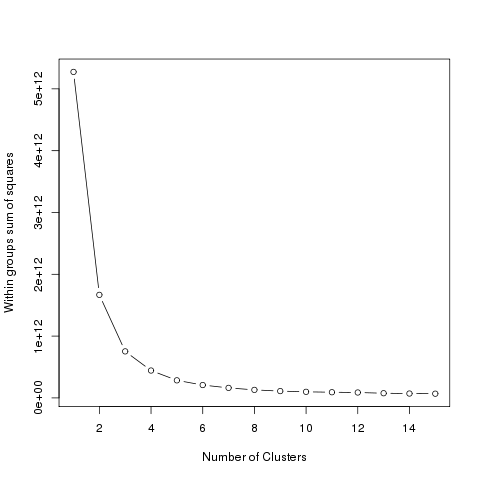
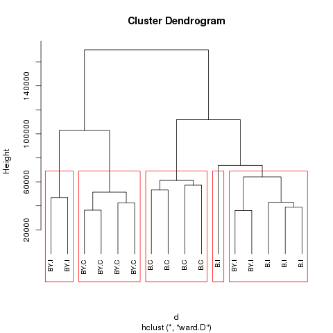
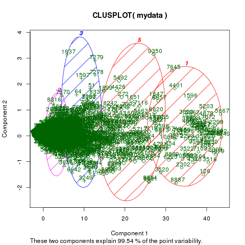

# Tarea 7.2: Análisis funcional de datos de microarreglos
## Particionamiento
Partir del objeto `normdata` creado en la tarea 7.1.

```mydata <- normdata```

Cambiar los nombres de las columnas para facilitar la visualización en los gŕaficos

```
design <- read.csv("YChrom_design.csv")
colnames(mydata) <- design$Group
```
#### Determinar el número de grupos
Para determinar el número de clusters, se realizó una gráfica de suma de cuadrados.

```
wss <- (nrow(mydata)-1)*sum(apply(mydata,2,var))
for (i in 2:15) wss[i] <- sum(kmeans(mydata,
   centers=i)$withinss)
plot(1:15, wss, type="b", xlab="Number of Clusters",
  ylab="Within groups sum of squares")
  dev.copy(png,'../tarea7.2/output/clusters.png')
  dev.off()
```


#### K-Means Cluster Analysis
De acuerdo con la gráfica de suma de cuadrados se seleccionó un total de 5 clusters para el análisis de k-means, ya que es a partir de este valor que se observa un cambio abrupto en la gŕafica.
```
fit <- kmeans(mydata, 5) # 5 cluster solution
# get cluster means
aggregate(mydata,by=list(fit$cluster),FUN=mean)
```


#### Append cluster assignment
```
library(factoextra)
fviz_cluster(fit, data = mydata)
dev.copy(png,'../tarea7.2/output/K_means.png')
dev.off()

mydata <- data.frame(mydata, fit$cluster)
```
## Clúster jerárquico

```
d <- dist(t(mydata), method = "euclidean") # distance matrix
fit <- hclust(d, method="ward.D")
plot(fit, hang = -1, cex = 0.8) # display dendogram
groups <- cutree(fit, k=5) # cut tree into 5 clusters
# draw dendogram with red borders around the 5 clusters
rect.hclust(fit, k=5, border="red")
dev.copy(png,'../tarea7.2/output/hier_clusters.png')
dev.off()
```


De acuerdo con el cluster jerárquico se observa que, por un lado, hay un agrupamiento por genotipo BY, el cual a su vez se agrupa por tratamiento y por control. Por otro lado, el genotipo B se separa de la misma manera, entre los control y los experimentales. Sin embargo, en este caso se observa un par de casos en los que un par de muestras del genotipo BY para el grupo control, se agrupa junto con el control del genotipo B. Es decir, el principal agrupamiento se da, en general, por genotipo y, dentro de cada genotipo, por tratamiento.

### Generación de gráficos
Finalmente, se generó el gráfico con los clusters, para visualizar el agrupamiento. 
```
fit <- kmeans (mydata, 5)

library(cluster)
clusplot(mydata, fit$cluster, color=TRUE, shade=TRUE,
   labels=2, lines=0)
   dev.copy(png,'../tarea7.2/output/clusters_2.png')
   dev.off()

```

