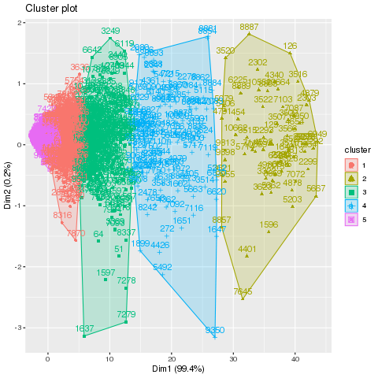

# Tarea 7.2: Análisis funcional de datos de microarreglos
## Particionamiento
Partir del objeto normdata creado en la tarea 7.1.

```mydata <- normdata```

Cambiar los nombres de las columnas para facilitar la visualización en los gŕaficos

```
design <- read.csv("YChrom_design.csv")
colnames(mydata) <- design$Group
```
#### Determinar el número de grupos
```
wss <- (nrow(mydata)-1)*sum(apply(mydata,2,var))
for (i in 2:15) wss[i] <- sum(kmeans(mydata,
   centers=i)$withinss)
plot(1:15, wss, type="b", xlab="Number of Clusters",
  ylab="Within groups sum of squares")
  dev.copy(png,'../tarea7.2/output/clusters.png')
  dev.off()
```


#### K-Means Cluster Analysis
```
fit <- kmeans(mydata, 5) # 5 cluster solution
# get cluster means
aggregate(mydata,by=list(fit$cluster),FUN=mean)
```



#### Append cluster assignment
```
library(factoextra)
fviz_cluster(fit, data = mydata)
dev.copy(png,'../tarea7.2/output/K_means.png')
dev.off()

mydata <- data.frame(mydata, fit$cluster)
```
## Clúster jerárquico

```
d <- dist(t(mydata), method = "euclidean") # distance matrix
fit <- hclust(d, method="ward.D")
plot(fit, hang = -1, cex = 0.8) # display dendogram
groups <- cutree(fit, k=5) # cut tree into 5 clusters
# draw dendogram with red borders around the 5 clusters
rect.hclust(fit, k=5, border="red")
dev.copy(png,'../tarea7.2/output/hier_clusters.png')
dev.off()
```


### Generación de gráficos
```
fit <- kmeans (mydata, 5)

library(cluster)
clusplot(mydata, fit$cluster, color=TRUE, shade=TRUE,
   labels=2, lines=0)
   dev.copy(png,'../tarea7.2/output/clusters_2.png')
   dev.off()

```

